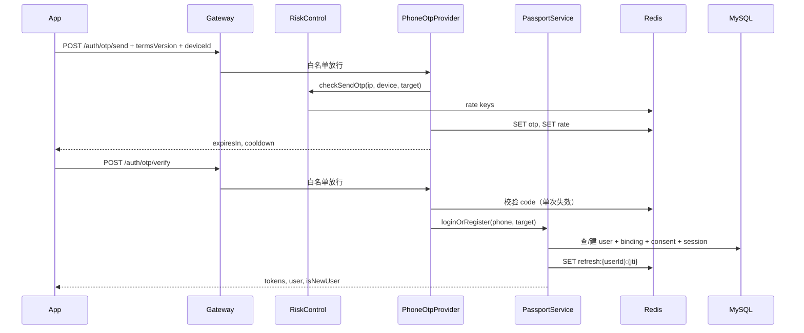

# Kairos 登录 / 注册后端 TRD

| 项目 | 说明 |
|------|------|
| 文档版本 | **v1.1** |
| 创建日期 | 2026-05-21 |
| 架构参考 | 小红书（RED）App 登录体系（Passport + 网关鉴权 + 多绑定 + 风控），按本项目能力裁剪 |
| 关联前端 | `karios-mobile/kairos-mobile` 认证模块 |
| 关联契约 | [api-contract.md](./api-contract.md)、[database-schema.md](./database-schema.md) |
| 编码规范 | [后端规范.md](./后端规范.md) |
| 服务工程 | `karios-service-api`（Spring Boot，包名建议 `org.example.karios`） |

---

## 1. 背景与目标

### 1.1 前端现状（需对齐）

当前移动端登录能力（`USE_MOCK_API = false` 时对接真实接口）：

| 优先级 | 登录方式 | 前端入口 | 后端能力 |
|--------|----------|----------|----------|
| 1 | 手机号 + OTP | 欢迎页主按钮 | `CredentialProvider=phone` |
| 2 | Apple 登录 | 欢迎页（iOS） | `CredentialProvider=apple` |
| 3 | 邮箱 + OTP | 「其他登录方式」底部弹层 | `CredentialProvider=email` |

**业务规则（与前端一致）：**

- **无独立「注册」页/接口**：验码或 OAuth 成功即 **登录；账号不存在则自动注册**（Login-or-Register，与小红书一致）。
- 登录前须勾选 **《用户协议》+《隐私政策》**；后端在 **发码 / 验码 / OAuth** 时校验版本并落库。
- 登录成功 `profileStatus = incomplete` → 资料完善 → `PUT /users/me`。
- Token：`accessToken` + `refreshToken` + `expiresIn`；业务请求 `Authorization: Bearer {accessToken}`。
- 统一响应：`{ code, message, data }`，`code = 0` 成功。

### 1.2 本 TRD 范围

| 在范围内 | 不在范围内（后续 TRD） |
|----------|------------------------|
| 网关层 + Passport 登录域 | 社区 Feed、帖子、搜索、草稿 |
| OTP / Apple / 绑定查询 | 微信 OAuth 真实实现（stub） |
| 会话（Session）与 Token 生命周期 | Elasticsearch、推荐、IM |
| 轻量风控（限流、设备维度） | 运营商一键登录（见 §2.4 二期） |
| 用户资料 `GET/PUT /users/me` | 对象存储、图片上传 |

### 1.3 目标

1. **所有 API 经网关**，除白名单外必须 Token 校验通过（与小红书「全站带登录态」一致）。
2. **统一账号体系**：一个 `user_id`，多种 `user_auth_bindings`（与小红书「手机号 + 第三方」绑定模型一致）。
3. MVP 基于 **MySQL 8 + Redis**；扩展组件（ES、MQ 等）仅在有明确需求时引入。
4. 分层遵循 [后端规范.md](./后端规范.md)，契约与 [api-contract.md](./api-contract.md) 对齐。

---

## 2. 参考小红书登录架构（映射到 Kairos）

> 以下为业界常见的小红书类 App 登录架构抽象（非其内部实现细节），用于指导本项目建设；**落地时按在日留学生场景与当前工程能力裁剪**。

### 2.1 小红书典型分层（抽象）

```
┌──────────────┐
│   Client     │  手机号优先 / 一键登录(国内) / 微信·Apple / 协议勾选
└──────┬───────┘
       │ HTTPS
       ▼
┌──────────────────────────────────────┐
│  API Gateway（统一入口）               │
│  · 路由、鉴权、限流、TraceId            │
│  · 未登录白名单 vs 登录态强制           │
└──────┬───────────────────────────────┘
       ▼
┌──────────────────────────────────────┐
│  Passport / 账号中心（登录注册域）       │
│  · Login-or-Register 统一编排          │
│  · 多 CredentialProvider 适配          │
│  · Token 签发 / 刷新 / 失效            │
│  · 绑定关系、协议同意、会话管理          │
└──────┬───────────────────────────────┘
       │
   ┌───┴───┬──────────┐
   ▼       ▼          ▼
 MySQL   Redis    外部 IdP
(账号)  (OTP/会话) (Apple/微信…)
       │
       ▼
┌──────────────────────────────────────┐
│  风控 / 反作弊（轻量）                  │
│  · IP/设备/手机号 频率限制              │
│  · 异常触发图形验证码（二期）            │
└──────────────────────────────────────┘
```

### 2.2 与 Kairos 当前能力的映射

| 小红书常见能力 | Kairos 现状 | 本 TRD 决策 |
|----------------|-------------|-------------|
| 手机号为主登录 | 欢迎页「手机号登录」主按钮 | **MVP 核心**：`phone` + OTP |
| 运营商一键登录 | 无 | **二期**（国内号码 + 运营商 SDK），日本场景继续 OTP |
| 微信 / Apple 等 OAuth | Apple 有；微信占位 | **MVP**：Apple；微信 `501` stub |
| 邮箱等「其他方式」 | 底部弹层邮箱 | **MVP**：`email` + OTP |
| 登录即注册 | 前端已无单独注册 | **统一** `PassportService.loginOrRegister` |
| 协议勾选后才可以登录 | `TermsAgreementRow` | 后端校验 `termsVersion` + `user_terms_consents` |
| 新用户资料引导 | `ProfileSetupScreen` | `profileStatus=incomplete` + `PUT /users/me` |
| 网关全站鉴权 | TRD 已要求 gateway 包 | **强制** `AuthGatewayFilter` |
| 多方式绑定同一账号 | `GET /auth/bindings` | **MVP 查询**；**二期** `POST /auth/bindings` 主动绑定 |
| 多设备会话 / 踢下线 | 无 | **MVP** `user_sessions` 表 + Redis；设置页踢设备 **二期** |
| 图形验证码 / 滑块 | 无 | **二期**（风控升级） |
| 独立 Passport 微服务 | 单体 `karios-service-api` | **MVP 单体内 `service/auth` 模块**；流量上来再拆 |

### 2.3 登录漏斗（与前端 UI 一致）

与小红书「主路径 + 次级 OAuth + 更多方式收纳」一致，后端按 **Credential 类型** 路由到同一编排器：

```
欢迎页
 ├─ [主] 手机号 ──► OtpCredentialProvider ──► PassportService
 ├─ [次] Apple  ──► AppleCredentialProvider ──► PassportService
 └─ [更多] 邮箱 ──► OtpCredentialProvider(email) ──► PassportService
         │
         ▼
   协议版本校验（send / verify / oauth 均需）
         │
         ▼
   loginOrRegister → 签发 Token + 写 Session
         │
         ├─ isNewUser=true  → profileStatus=incomplete
         └─ isNewUser=false → 直接进主页
```

### 2.4 能力分期（避免过度设计）

| 阶段 | 能力 | 依赖 |
|------|------|------|
| **MVP** | 网关鉴权、OTP、Apple、Login-or-Register、Token 刷新/登出、协议落库、轻量风控、Session 记录 | MySQL + Redis |
| **P1** | 主动绑定手机/邮箱/Apple、`POST /auth/bindings` | 同上 |
| **P2** | 图形验证码、设备指纹、异常登录告警 | Redis + 可选 OSS 静态页 |
| **P3** | 微信登录、运营商一键登录 | 微信开放平台、运营商 SDK |
| **P4** | Passport 独立服务 / 网关独立部署 | 微服务、注册中心（可选） |

**明确不纳入登录 MVP：** Elasticsearch（账号域无检索）、Kafka（同步链路短）、Nacos。

---

## 3. 总体架构设计

### 3.1 逻辑架构（Passport 域）

```
┌─────────────────┐
│  React Native   │
│  kairos-mobile  │
└────────┬────────┘
         │  /api/v1/**  +  X-Device-Id（建议）
         ▼
┌─────────────────────────────────────────┐
│  gateway 层                              │
│  · AuthGatewayFilter（白名单 + JWT）      │
│  · RateLimitGatewayFilter（IP 全局，可选） │
│  · RequestContext（userId, sessionId）    │
└────────┬────────────────────────────────┘
         ▼
┌─────────────────────────────────────────┐
│  web/auth → service/auth (Passport)      │
│  · PassportService（loginOrRegister）    │
│  · CredentialProvider 策略                │
│  · TokenService / SessionService          │
│  · RiskControlService（OTP 前检查）       │
└────────┬────────────────────────────────┘
         │
    ┌────┴────┬─────────────┐
    ▼         ▼             ▼
 MySQL 8   Redis 6+    Apple JWKS HTTPS
```

**部署说明：** MVP 为 **单 Spring Boot 进程** 内 `gateway` + `service/auth`；与小红书后期「网关 + Passport 微服务」拓扑兼容，拆分时不改对外 API。

### 3.2 技术栈

| 组件 | 版本 | 用途 |
|------|------|------|
| Java 17 | — | 运行时 |
| Spring Boot 3.x/4.x | — | Web、DI |
| MyBatis / MyBatis-Plus | 3.5+ | 持久化 |
| MySQL 8 | 本地已有 | users、bindings、sessions、consents |
| Redis 6+ | 本地已有 | OTP、限流、Session 索引、JWT 黑名单 |
| Flyway | — | 迁移脚本 |
| JWT 库 | jjwt / nimbus | Access / Refresh |

### 3.3 可选组件说明

| 组件 | 登录 MVP | 说明 |
|------|----------|------|
| Elasticsearch | 否 | 用于帖子/搜索 TRD，不参与账号认证 |
| Kafka / RabbitMQ | 否 | 登录写库 + Redis 足够；审计日志量大时再考虑 |
| MinIO / OSS | 否 | 头像属用户资料域 |
| SMS / Email | Mock | 抽象 `SmsProvider` / `EmailProvider` |
| 微信开放平台 | 否（stub） | P3 对接，表结构已预留 `wechat` |
| 图形验证码服务 | 否 | P2；风控触发时使用 |

---

## 4. 网关层（强制，对齐小红书「全站鉴权」）

> [后端规范.md](./后端规范.md)：**gateway 层放拦截器等**。所有 `/api/v1/**` 必须先过网关。

### 4.1 职责

| 编号 | 职责 | 对标小红书 |
|------|------|------------|
| G1 | 统一前缀 `/api/v1` | 统一 API 网关入口 |
| G2 | 白名单：登录、发码、刷新、健康检查 | 未登录可访问的少数接口 |
| G3 | JWT 校验：签名、过期、`jti` 黑名单 | 登录态校验 |
| G4 | 注入 `userId`、`sessionId`（从 Claims） | 下游免重复解析 Token |
| G5 | 401 统一 `40101` | 客户端跳登录 |
| G6 | `X-Request-Id` 链路追踪 | 日志排障 |
| G7 | CORS（RN 调试） | — |
| G8 | 可选：全局限流 `rate:ip:{ip}` | 防刷接口 |

### 4.2 白名单（无需 Access Token）

| 方法 | 路径 | 说明 |
|------|------|------|
| POST | `/api/v1/auth/otp/send` | 发码（内含风控） |
| POST | `/api/v1/auth/otp/verify` | 验码登录/注册 |
| POST | `/api/v1/auth/oauth/apple` | Apple 登录 |
| POST | `/api/v1/auth/oauth/wechat` | 预留 501 |
| POST | `/api/v1/auth/oauth/google` | 预留 501 |
| POST | `/api/v1/auth/refresh` | Refresh Token |
| GET | `/api/v1/health` | 健康检查 |
| GET | `/api/v1/legal/terms` | 协议正文（可选） |

**必须 Token：** `logout`、`bindings`、`* /users/*`、帖子/草稿等所有业务 API。

### 4.3 过滤器链顺序

```
1. TraceIdFilter
2. RateLimitGatewayFilter（可选，IP 维度）
3. AuthGatewayFilter（白名单 / JWT / 黑名单 / RequestContext）
4. DispatcherServlet → Controller
```

### 4.4 网关包结构

```
gateway/
├── AuthGatewayFilter.java
├── RateLimitGatewayFilter.java      # MVP 可仅 IP 限流
├── JwtTokenProvider.java
├── GatewayWhitelistProperties.java
├── RequestContext.java              # userId, sessionId, jti
└── GatewayConstants.java
```

---

## 5. Passport 账号中心（核心业务域）

### 5.1 领域模型

| 概念 | 存储 | 说明 |
|------|------|------|
| **User** | `users` | 账号主实体，全局 `user_id` |
| **Credential** | `user_auth_bindings` | 登录凭证：phone / email / apple / wechat |
| **Session** | `user_sessions` + Redis | 一次登录产生一条会话，对应 refresh `jti` |
| **TermsConsent** | `user_terms_consents` | 协议同意审计 |
| **Token** | JWT + Redis | Access 短效；Refresh 长效 + 可吊销 |

**主凭证策略（小红书思路：优先手机号）：**

- 新用户首次 **手机 OTP** 登录 → 该手机为主凭证。
- 新用户首次 **Apple** 登录 → 无手机时 `primary_credential=apple`，资料页引导 **绑定手机**（二期接口）。
- **邮箱** 定位为补充凭证，放在「其他登录方式」。

`users` 表建议增加（`V3__user_primary_credential.sql`）：

| 列 | 类型 | 说明 |
|----|------|------|
| primary_credential | VARCHAR(16) NULL | `phone` / `email` / `apple`，首次注册渠道 |

### 5.2 PassportService 统一编排

所有登录方式 **禁止** 在 Controller 内各自建用户，必须经：

```java
LoginResult PassportService.loginOrRegister(LoginCommand cmd);
```

`LoginCommand` 包含：`credentialType`、`providerUserId`、`termsVersion`、`deviceId`、`clientMeta`。

**流程：**

1. `RiskControlService.checkBeforeLogin(cmd)` — 限流、黑名单。
2. 查 `user_auth_bindings(provider, provider_user_id)`。
3. **不存在** → 事务创建 `users` + `binding` + `consent` + `session`。
4. **存在** → 校验 `users.status=active`；更新 `last_login_at`；创建新 `session`（允许多设备）。
5. `TokenService.issueTokenPair(userId, sessionId)` → 返回 `AuthTokens` + **`isNewUser`**。

### 5.3 CredentialProvider 策略（可扩展）

| Provider | 实现类 | MVP |
|----------|--------|-----|
| phone | `PhoneOtpCredentialProvider` | 是 |
| email | `EmailOtpCredentialProvider` | 是 |
| apple | `AppleCredentialProvider` | 是 |
| wechat | `WechatCredentialProvider` | stub → 501 |

```java
public interface CredentialProvider {
  CredentialType support();
  VerifiedCredential verify(CredentialVerifyRequest req);
}
```

OTP 发码/验码在 Provider 内操作 Redis；验码成功后构造 `VerifiedCredential` 交给 `PassportService`。

### 5.4 登录时序（手机号，含风控）



### 5.5 Apple 登录

与 OTP 共用 `PassportService.loginOrRegister`：

1. `AppleCredentialProvider` JWKS 校验 `identityToken`（`sub`、`aud`、`exp`）。
2. `provider=apple`，`provider_user_id=sub`。
3. 可选首次写入 `email`、`fullName` 到 `users`（仅 nickname 为空时）。

### 5.6 用户协议

表 **`user_terms_consents`**：

| 列 | 类型 | 说明 |
|----|------|------|
| id | BIGINT PK | |
| user_id | BIGINT FK | |
| terms_version | VARCHAR(32) | |
| privacy_version | VARCHAR(32) | |
| agreed_at | DATETIME | |
| client_ip | VARCHAR(64) | |
| user_agent | VARCHAR(256) | |
| device_id | VARCHAR(64) NULL | 与客户端 `X-Device-Id` 一致 |

配置：`kairos.legal.terms-version`、`kairos.legal.privacy-version`。

- `send` / `verify` / `oauth/*` 必须传 `termsVersion`，不匹配 → `40001`。
- 仅 **首次注册** 写入 consent；老用户登录可跳过插入（或写审计表，MVP 前者即可）。

### 5.7 Token 与会话（对齐小红书「登录态 + 可续期」）

| 项 | 值 |
|----|-----|
| Access TTL | 900s（15min） |
| Refresh TTL | 7d |
| Access Claims | `sub`=userId, `sid`=sessionId, `typ`=access, `jti`, `exp` |
| Refresh Claims | `sub`=userId, `sid`=sessionId, `typ`=refresh, `jti`, `exp` |

**Redis：**

| Key | TTL | 说明 |
|-----|-----|------|
| `otp:{channel}:{target}` | 300s | 验证码 |
| `otp:rate:{channel}:{target}` | 60s | 发码冷却 |
| `otp:daily:{channel}:{target}` | 24h | 每日上限 |
| `rate:ip:{ip}` | 1min | 网关/IP 限流 |
| `rate:device:{deviceId}` | 1min | 设备维度（可选） |
| `refresh:{userId}:{jti}` | 7d | Refresh 有效 |
| `jwt:blacklist:{jti}` | 至 exp | 登出/封禁 |

**`user_sessions` 表（MVP 建议新增）：**

| 列 | 类型 | 说明 |
|----|------|------|
| id | BIGINT PK | sessionId |
| user_id | BIGINT | |
| refresh_jti | VARCHAR(64) | 与 JWT 对应 |
| device_id | VARCHAR(64) NULL | |
| device_name | VARCHAR(128) NULL | 客户端上报 |
| platform | VARCHAR(16) NULL | ios / android |
| ip | VARCHAR(64) NULL | |
| last_active_at | DATETIME | |
| revoked_at | DATETIME NULL | 登出时间 |
| created_at | DATETIME | |

登出：`revoked_at=now`，Redis 删 refresh + Access `jti` 入黑名单。

**Refresh 策略（推荐小红书式「滑动续期」）：**

- `POST /auth/refresh` 校验 Refresh 合法 → 签发 **新 Access**。
- **MVP**：Refresh Token 不轮换（实现简单）。
- **P1**：Refresh 轮换（旧 refresh 立即失效，防重放）。

### 5.8 登出与刷新

| 接口 | 网关 | 行为 |
|------|------|------|
| POST `/auth/refresh` | 白名单 | 校验 Refresh + Redis → 新 Access |
| POST `/auth/logout` | 需 Access | 吊销当前 session + 黑名单 Access `jti` |

**前端建议（对标小红书长登录）：** `api/client.ts` 在 401 时先 `refresh` 再重试，失败再 `logout()`。

---

## 6. 风控层（轻量，小红书式前置校验）

MVP 在 **发码前** 集中校验，避免分散在各 Provider：

| 规则 | 维度 | 动作 |
|------|------|------|
| 发码冷却 | target | 60s 内拒绝 `42901` |
| 日发送上限 | target | 10 次/天 `42901` |
| IP 高频 | ip | 如 30 次/分钟 `42901` |
| 设备高频 | deviceId | 可选，同上 |
| 账号封禁 | userId | `users.status=suspended` → `40301` |

**二期：** 异常分数累计 → 要求图形验证码（接口返回 `data.needCaptcha=true`）。

```
service/auth/
└── RiskControlService.java
```

---

## 7. 接口定义

Base URL：`http://127.0.0.1:8080/api/v1`（与前端 `config.ts` 一致）。

### 7.1 公共请求头（建议）

| Header | 必填 | 说明 |
|--------|------|------|
| `Authorization` | 登录后 | `Bearer {accessToken}` |
| `X-Device-Id` | 建议 | 客户端生成的 UUID，风控与 Session |
| `X-Request-Id` | 否 | 客户端生成或网关生成 |
| `X-Platform` | 否 | `ios` / `android` |
| `X-App-Version` | 否 | 如 `0.0.1` |

### 7.2 POST `/auth/otp/send`

```json
{
  "channel": "phone",
  "target": "13800138000",
  "termsVersion": "2026-05-01",
  "privacyVersion": "2026-05-01",
  "deviceId": "uuid"
}
```

**Response `data`：** `{ "expiresIn": 300, "cooldown": 60 }`

### 7.3 POST `/auth/otp/verify`

```json
{
  "channel": "phone",
  "target": "13800138000",
  "code": "123456",
  "termsVersion": "2026-05-01",
  "deviceId": "uuid",
  "deviceName": "iPhone 16"
}
```

**Response `data`（在 api-contract 基础上扩展）：**

```json
{
  "accessToken": "eyJ...",
  "refreshToken": "eyJ...",
  "expiresIn": 900,
  "isNewUser": true,
  "user": {
    "id": "1",
    "nickname": null,
    "avatarUrl": null,
    "profileStatus": "incomplete",
    "isVerified": false
  }
}
```

| 字段 | 说明 |
|------|------|
| `isNewUser` | 本次是否新注册（小红书用于决定是否展示资料引导） |

### 7.4 POST `/auth/oauth/apple`

同前，增加 `termsVersion`、`deviceId`；Response 同 §7.3。

### 7.5 POST `/auth/oauth/{provider}`

| provider | 行为 |
|----------|------|
| wechat / google | `501` / `50101` |

### 7.6 POST `/auth/refresh` / `/auth/logout` / GET `/auth/bindings`

与 [api-contract.md](./api-contract.md) 一致；`logout` 可带 `sessionId` 仅登出当前设备（二期）。

### 7.7 GET `/legal/terms`（可选）

返回当前 `termsVersion`、协议 H5 URL 或 Markdown，供 App 内嵌页（对标小红书协议页）。

### 7.8 登录后资料

| 方法 | 路径 | 说明 |
|------|------|------|
| GET | `/users/me` | 需 Token |
| PUT | `/users/me` | 资料完善，`profileStatus→complete` |

### 7.9 二期：账号绑定（小红书「设置-账号与安全」）

| 方法 | 路径 | 说明 |
|------|------|------|
| POST | `/auth/bindings/phone` | 已登录用户绑定手机 |
| POST | `/auth/bindings/email` | 绑定邮箱 |
| DELETE | `/auth/bindings/{provider}` | 解绑（保留至少一种） |

---

## 8. 数据库设计

登录注册域涉及表如下（字段说明见 [database-schema.md](./database-schema.md)）：

| 表 | 说明 |
|----|------|
| `users` | 账号主表，含 `primary_credential`、`last_login_at` |
| `user_auth_bindings` | 手机 / 邮箱 / Apple 等登录凭证 |
| `user_terms_consents` | 用户协议与隐私政策同意记录 |
| `user_sessions` | 登录会话，对应 Refresh Token / 多设备 |

**可执行建表语句见本文档 §16**；亦可直接执行 `preparationWork/sql/kairos_init_schema.sql`。

Flyway 落地建议：将 §16 SQL 拆为 `karios-service-api/src/main/resources/db/migration/V1__init_schema.sql`。

---

## 9. 模块与类设计（遵循后端规范）

```
org.example.karios
├── gateway/                          # §4
├── web/auth/AuthController.java
├── web/user/UserController.java
├── service/auth/
│   ├── PassportService.java          # loginOrRegister 统一入口
│   ├── TokenService.java
│   ├── SessionService.java
│   ├── RiskControlService.java
│   ├── impl/PassportServiceImpl.java
│   ├── credential/
│   │   ├── CredentialProvider.java
│   │   ├── PhoneOtpCredentialProvider.java
│   │   ├── EmailOtpCredentialProvider.java
│   │   └── AppleCredentialProvider.java
│   └── external/AppleJwksClient.java
├── mapper/auth/
├── entity/
├── model/request|response|bo/
├── config/
└── common/
```

---

## 10. 错误码

| code | HTTP | 场景 |
|------|------|------|
| 0 | 200 | 成功 |
| 40001 | 400 | 参数/验证码/协议版本错误 |
| 40101 | 401 | 未登录、Token 无效、已吊销 |
| 40301 | 403 | 账号封禁 |
| 42901 | 429 | 风控限流 |
| 50101 | 501 | 微信/Google 未实现 |
| 50001 | 500 | 系统错误 |

---

## 11. 配置项（application.yml）

```yaml
server:
  port: 8080

spring:
  datasource:
    url: jdbc:mysql://127.0.0.1:3306/kairos?useUnicode=true&characterEncoding=utf8mb4&serverTimezone=Asia/Tokyo
    username: root
    password: ${MYSQL_PASSWORD:}
  data:
    redis:
      host: 127.0.0.1
      port: 6379

kairos:
  legal:
    terms-version: "2026-05-01"
    privacy-version: "2026-05-01"
  auth:
    jwt:
      secret: ${JWT_SECRET:dev-only-change-me}
      access-ttl-seconds: 900
      refresh-ttl-days: 7
      refresh-rotate: false          # P1 改为 true
    otp:
      ttl-seconds: 300
      cooldown-seconds: 60
      daily-limit: 10
      dev-code: "123456"
    apple:
      bundle-id: org.reactjs.native.example.KairosMobile
    risk:
      ip-per-minute: 30
      device-per-minute: 20
  gateway:
    whitelist: # 见 §4.2
```

---

## 12. 安全与合规

| 项 | 要求 |
|----|------|
| 验证码 | 6 位、Redis、单次失效 |
| 风控 | 发码前集中校验（§6） |
| 协议 | 首次注册落库；版本由配置中心 |
| 日志 | 禁止生产打印验证码、完整 Token |
| 多设备 | Session 表记录；登出吊销 |
| HTTPS | 生产强制 |

---

## 13. 实施计划

| 阶段 | 交付 | 预估 |
|------|------|------|
| P0 | V1–V3 迁移 + Redis + 配置 | 0.5d |
| P1 | gateway 过滤器链 + RequestContext | 1d |
| P2 | CredentialProvider + PassportService + OTP | 1.5d |
| P3 | Token + Session + refresh/logout | 1d |
| P4 | Apple + RiskControl + `isNewUser` | 1d |
| P5 | `/users/me` 资料链 | 1d |
| P6 | 联调（`USE_MOCK_API=false`）+ 更新 api-contract | 1d |

**验收：**

1. 网关：无 Token 访问 `/users/me` → `40101`。
2. 手机号两次登录 `user_id` 不变；第二次 `isNewUser=false`。
3. 登出后旧 Token 不可用。
4. `dev-code=123456` 可验码。
5. 发码超限返回 `42901`。

---

## 14. 前后端联调清单

| # | 前端 | 后端 | 改造点 |
|---|------|------|--------|
| 1 | `authApi.sendOtp` | POST `/auth/otp/send` | +`termsVersion`, `deviceId` |
| 2 | `authApi.verifyOtp` | POST `/auth/otp/verify` | 同上；处理 `isNewUser` |
| 3 | `authApi.loginApple` | POST `/auth/oauth/apple` | +`termsVersion`, `deviceId` |
| 4 | `api/client.ts` | POST `/auth/refresh` | 401 先 refresh |
| 5 | `ProfileSetupScreen` | PUT `/users/me` | `isNewUser` 或 `profileStatus` |
| 6 | `authApi.getBindings` | GET `/auth/bindings` | 设置页（二期绑定 UI） |

---

## 15. 附录

### 15.1 与 api-contract 的差异（v1.1 待同步）

| 项 | api-contract 现状 | TRD v1.1 |
|----|-------------------|----------|
| `termsVersion` | 未写 | 发码/验码/OAuth 必填 |
| `deviceId` | 未写 | 建议 Header + Body |
| `isNewUser` | 未写 | verify/oauth 响应增加 |
| `user_sessions` | 未写 | 新增表 |

### 15.2 参考文档

- [api-contract.md](./api-contract.md)
- [database-schema.md](./database-schema.md)
- [后端规范.md](./后端规范.md)
- [DEVELOPMENT_PLAN.md](./DEVELOPMENT_PLAN.md)

### 15.3 修订记录

| 版本 | 日期 | 说明 |
|------|------|------|
| v1.0 | 2026-05-21 | 初稿：网关强制、OTP 登录即注册、MySQL+Redis |
| v1.1 | 2026-05-21 | 参考小红书架构：Passport 域、CredentialProvider、Session、风控、能力分期、`isNewUser` |
| v1.2 | 2026-05-21 | 附录 §16：登录注册域及 MVP 全量建表 SQL |
| v1.3 | 2026-05-21 | 建表 SQL 全部字段补充 COMMENT |

---

## 16. 建表 SQL（MySQL 8.0+）

> 字符集 `utf8mb4`，排序规则 `utf8mb4_unicode_ci`，引擎 InnoDB。  
> **所有表、字段均含 `COMMENT`（中文注释）**，以 `preparationWork/sql/kairos_init_schema.sql` 为准。  
> 本地执行见 `preparationWork/sql/README.md`（避免 `mysql -u root -p < file` 与密码提示冲突）。

```sql
-- ============================================================
-- Kairos 数据库初始化
-- 登录注册域：users, user_auth_bindings, user_terms_consents, user_sessions
-- MVP 业务域：posts, post_images, post_likes, post_comments, post_favorites,
--             user_follows, drafts
-- ============================================================

CREATE DATABASE IF NOT EXISTS kairos
  DEFAULT CHARACTER SET utf8mb4
  DEFAULT COLLATE utf8mb4_unicode_ci;

USE kairos;

-- ------------------------------------------------------------
-- 1. 用户主表
-- ------------------------------------------------------------
CREATE TABLE IF NOT EXISTS users (
  id                 BIGINT UNSIGNED NOT NULL AUTO_INCREMENT COMMENT '用户 ID',
  nickname           VARCHAR(64)     NULL COMMENT '昵称',
  avatar_url         VARCHAR(512)    NULL COMMENT '头像 URL',
  bio                VARCHAR(500)    NULL COMMENT '简介',
  university         VARCHAR(128)    NULL COMMENT '学校',
  city               VARCHAR(32)     NULL COMMENT '城市 code，如 tokyo',
  user_type          VARCHAR(32)     NULL COMMENT '身份：graduate_student 等',
  profile_status     VARCHAR(16)     NOT NULL DEFAULT 'incomplete' COMMENT 'incomplete | complete',
  primary_credential VARCHAR(16)     NULL COMMENT '首次注册渠道：phone | email | apple',
  status             VARCHAR(16)     NOT NULL DEFAULT 'active' COMMENT 'active | suspended | deleted',
  is_verified        TINYINT(1)      NOT NULL DEFAULT 0 COMMENT '是否认证用户',
  last_login_at      DATETIME(3)     NULL COMMENT '最近登录时间',
  created_at         DATETIME(3)     NOT NULL DEFAULT CURRENT_TIMESTAMP(3),
  updated_at         DATETIME(3)     NOT NULL DEFAULT CURRENT_TIMESTAMP(3) ON UPDATE CURRENT_TIMESTAMP(3),
  PRIMARY KEY (id),
  KEY idx_users_status (status),
  KEY idx_users_city (city),
  KEY idx_users_profile_status (profile_status)
) ENGINE=InnoDB DEFAULT CHARSET=utf8mb4 COLLATE=utf8mb4_unicode_ci COMMENT='用户';

-- ------------------------------------------------------------
-- 2. 登录凭证绑定（Passport）
-- ------------------------------------------------------------
CREATE TABLE IF NOT EXISTS user_auth_bindings (
  id               BIGINT UNSIGNED NOT NULL AUTO_INCREMENT,
  user_id          BIGINT UNSIGNED NOT NULL COMMENT 'users.id',
  provider         VARCHAR(32)     NOT NULL COMMENT 'email | phone | apple | wechat | google',
  provider_user_id VARCHAR(255)    NOT NULL COMMENT '邮箱/手机/E.164/Apple sub/openid',
  credential_meta  JSON            NULL COMMENT '扩展元数据',
  created_at       DATETIME(3)     NOT NULL DEFAULT CURRENT_TIMESTAMP(3),
  updated_at       DATETIME(3)     NOT NULL DEFAULT CURRENT_TIMESTAMP(3) ON UPDATE CURRENT_TIMESTAMP(3),
  PRIMARY KEY (id),
  UNIQUE KEY uk_provider_uid (provider, provider_user_id),
  KEY idx_bindings_user (user_id),
  CONSTRAINT fk_bindings_user FOREIGN KEY (user_id) REFERENCES users (id)
) ENGINE=InnoDB DEFAULT CHARSET=utf8mb4 COLLATE=utf8mb4_unicode_ci COMMENT='登录方式绑定';

-- ------------------------------------------------------------
-- 3. 用户协议同意记录
-- ------------------------------------------------------------
CREATE TABLE IF NOT EXISTS user_terms_consents (
  id              BIGINT UNSIGNED NOT NULL AUTO_INCREMENT,
  user_id         BIGINT UNSIGNED NOT NULL COMMENT 'users.id',
  terms_version   VARCHAR(32)     NOT NULL COMMENT '用户协议版本',
  privacy_version VARCHAR(32)     NOT NULL COMMENT '隐私政策版本',
  agreed_at       DATETIME(3)     NOT NULL DEFAULT CURRENT_TIMESTAMP(3),
  client_ip       VARCHAR(64)     NULL,
  user_agent      VARCHAR(256)    NULL,
  device_id       VARCHAR(64)     NULL COMMENT '客户端 X-Device-Id',
  PRIMARY KEY (id),
  KEY idx_consents_user (user_id),
  KEY idx_consents_user_version (user_id, terms_version, privacy_version),
  CONSTRAINT fk_consents_user FOREIGN KEY (user_id) REFERENCES users (id)
) ENGINE=InnoDB DEFAULT CHARSET=utf8mb4 COLLATE=utf8mb4_unicode_ci COMMENT='协议同意';

-- ------------------------------------------------------------
-- 4. 登录会话（Token / 多设备）
-- ------------------------------------------------------------
CREATE TABLE IF NOT EXISTS user_sessions (
  id            BIGINT UNSIGNED NOT NULL AUTO_INCREMENT COMMENT 'sessionId，写入 JWT sid',
  user_id       BIGINT UNSIGNED NOT NULL,
  refresh_jti   VARCHAR(64)     NOT NULL COMMENT 'Refresh Token 的 jti',
  device_id     VARCHAR(64)     NULL,
  device_name   VARCHAR(128)    NULL,
  platform      VARCHAR(16)     NULL COMMENT 'ios | android',
  ip            VARCHAR(64)     NULL,
  last_active_at DATETIME(3)    NOT NULL DEFAULT CURRENT_TIMESTAMP(3),
  revoked_at    DATETIME(3)     NULL COMMENT '登出或踢下线时间',
  created_at    DATETIME(3)     NOT NULL DEFAULT CURRENT_TIMESTAMP(3),
  PRIMARY KEY (id),
  UNIQUE KEY uk_sessions_refresh_jti (refresh_jti),
  KEY idx_sessions_user (user_id),
  KEY idx_sessions_user_active (user_id, revoked_at),
  CONSTRAINT fk_sessions_user FOREIGN KEY (user_id) REFERENCES users (id)
) ENGINE=InnoDB DEFAULT CHARSET=utf8mb4 COLLATE=utf8mb4_unicode_ci COMMENT='用户会话';

-- ------------------------------------------------------------
-- 5. 帖子（MVP 社区，依赖 users）
-- ------------------------------------------------------------
CREATE TABLE IF NOT EXISTS posts (
  id             BIGINT UNSIGNED NOT NULL AUTO_INCREMENT,
  author_id      BIGINT UNSIGNED NOT NULL,
  domain         VARCHAR(16)     NOT NULL COMMENT 'career | life',
  category       VARCHAR(32)     NOT NULL,
  city           VARCHAR(32)     NULL,
  title          VARCHAR(200)    NOT NULL,
  summary        VARCHAR(500)    NULL,
  content        TEXT            NOT NULL,
  tags           JSON            NULL,
  company_name   VARCHAR(128)    NULL,
  position       VARCHAR(128)    NULL,
  like_count     INT UNSIGNED    NOT NULL DEFAULT 0,
  comment_count  INT UNSIGNED    NOT NULL DEFAULT 0,
  bookmark_count INT UNSIGNED    NOT NULL DEFAULT 0,
  view_count     INT UNSIGNED    NOT NULL DEFAULT 0,
  featured       TINYINT(1)      NOT NULL DEFAULT 0,
  status         VARCHAR(16)     NOT NULL DEFAULT 'published' COMMENT 'published | hidden | deleted',
  created_at     DATETIME(3)     NOT NULL DEFAULT CURRENT_TIMESTAMP(3),
  updated_at     DATETIME(3)     NOT NULL DEFAULT CURRENT_TIMESTAMP(3) ON UPDATE CURRENT_TIMESTAMP(3),
  PRIMARY KEY (id),
  KEY idx_posts_author (author_id),
  KEY idx_posts_city_created (city, created_at),
  KEY idx_posts_created (created_at),
  CONSTRAINT fk_posts_author FOREIGN KEY (author_id) REFERENCES users (id)
) ENGINE=InnoDB DEFAULT CHARSET=utf8mb4 COLLATE=utf8mb4_unicode_ci COMMENT='帖子';

CREATE TABLE IF NOT EXISTS post_images (
  id         BIGINT UNSIGNED NOT NULL AUTO_INCREMENT,
  post_id    BIGINT UNSIGNED NOT NULL,
  url        VARCHAR(512)    NOT NULL,
  sort_order INT             NOT NULL DEFAULT 0,
  PRIMARY KEY (id),
  KEY idx_post_images_post (post_id),
  CONSTRAINT fk_post_images_post FOREIGN KEY (post_id) REFERENCES posts (id)
) ENGINE=InnoDB DEFAULT CHARSET=utf8mb4 COLLATE=utf8mb4_unicode_ci COMMENT='帖子图片';

CREATE TABLE IF NOT EXISTS post_likes (
  id         BIGINT UNSIGNED NOT NULL AUTO_INCREMENT,
  post_id    BIGINT UNSIGNED NOT NULL,
  user_id    BIGINT UNSIGNED NOT NULL,
  created_at DATETIME(3)     NOT NULL DEFAULT CURRENT_TIMESTAMP(3),
  PRIMARY KEY (id),
  UNIQUE KEY uk_post_like (post_id, user_id),
  KEY idx_post_likes_user (user_id),
  CONSTRAINT fk_post_likes_post FOREIGN KEY (post_id) REFERENCES posts (id),
  CONSTRAINT fk_post_likes_user FOREIGN KEY (user_id) REFERENCES users (id)
) ENGINE=InnoDB DEFAULT CHARSET=utf8mb4 COLLATE=utf8mb4_unicode_ci COMMENT='帖子点赞';

CREATE TABLE IF NOT EXISTS post_comments (
  id         BIGINT UNSIGNED NOT NULL AUTO_INCREMENT,
  post_id    BIGINT UNSIGNED NOT NULL,
  author_id  BIGINT UNSIGNED NOT NULL,
  content    TEXT            NOT NULL,
  like_count INT UNSIGNED    NOT NULL DEFAULT 0,
  status     VARCHAR(16)     NOT NULL DEFAULT 'visible' COMMENT 'visible | deleted',
  created_at DATETIME(3)     NOT NULL DEFAULT CURRENT_TIMESTAMP(3),
  updated_at DATETIME(3)     NOT NULL DEFAULT CURRENT_TIMESTAMP(3) ON UPDATE CURRENT_TIMESTAMP(3),
  PRIMARY KEY (id),
  KEY idx_comments_post (post_id, created_at),
  CONSTRAINT fk_comments_post FOREIGN KEY (post_id) REFERENCES posts (id),
  CONSTRAINT fk_comments_author FOREIGN KEY (author_id) REFERENCES users (id)
) ENGINE=InnoDB DEFAULT CHARSET=utf8mb4 COLLATE=utf8mb4_unicode_ci COMMENT='帖子评论';

CREATE TABLE IF NOT EXISTS post_favorites (
  id         BIGINT UNSIGNED NOT NULL AUTO_INCREMENT,
  post_id    BIGINT UNSIGNED NOT NULL,
  user_id    BIGINT UNSIGNED NOT NULL,
  created_at DATETIME(3)     NOT NULL DEFAULT CURRENT_TIMESTAMP(3),
  PRIMARY KEY (id),
  UNIQUE KEY uk_post_favorite (post_id, user_id),
  CONSTRAINT fk_favorites_post FOREIGN KEY (post_id) REFERENCES posts (id),
  CONSTRAINT fk_favorites_user FOREIGN KEY (user_id) REFERENCES users (id)
) ENGINE=InnoDB DEFAULT CHARSET=utf8mb4 COLLATE=utf8mb4_unicode_ci COMMENT='帖子收藏';

CREATE TABLE IF NOT EXISTS user_follows (
  id          BIGINT UNSIGNED NOT NULL AUTO_INCREMENT,
  follower_id BIGINT UNSIGNED NOT NULL,
  followee_id BIGINT UNSIGNED NOT NULL,
  created_at  DATETIME(3)     NOT NULL DEFAULT CURRENT_TIMESTAMP(3),
  PRIMARY KEY (id),
  UNIQUE KEY uk_follow (follower_id, followee_id),
  KEY idx_follows_followee (followee_id),
  CONSTRAINT fk_follows_follower FOREIGN KEY (follower_id) REFERENCES users (id),
  CONSTRAINT fk_follows_followee FOREIGN KEY (followee_id) REFERENCES users (id)
) ENGINE=InnoDB DEFAULT CHARSET=utf8mb4 COLLATE=utf8mb4_unicode_ci COMMENT='用户关注';

CREATE TABLE IF NOT EXISTS drafts (
  id         BIGINT UNSIGNED NOT NULL AUTO_INCREMENT,
  user_id    BIGINT UNSIGNED NOT NULL,
  category   VARCHAR(32)     NOT NULL,
  title      VARCHAR(200)    NULL,
  content    TEXT            NOT NULL,
  tags       JSON            NULL,
  image_urls JSON            NULL,
  status     VARCHAR(16)     NOT NULL DEFAULT 'draft' COMMENT 'draft | published | discarded',
  created_at DATETIME(3)     NOT NULL DEFAULT CURRENT_TIMESTAMP(3),
  updated_at DATETIME(3)     NOT NULL DEFAULT CURRENT_TIMESTAMP(3) ON UPDATE CURRENT_TIMESTAMP(3),
  PRIMARY KEY (id),
  KEY idx_drafts_user (user_id, updated_at),
  CONSTRAINT fk_drafts_user FOREIGN KEY (user_id) REFERENCES users (id)
) ENGINE=InnoDB DEFAULT CHARSET=utf8mb4 COLLATE=utf8mb4_unicode_ci COMMENT='草稿';
```

### 16.1 登录域表关系

```
users 1──* user_auth_bindings
users 1──* user_terms_consents
users 1──* user_sessions
```

### 16.2 Redis 键（非 SQL，登录域使用）

| Key | TTL | 说明 |
|-----|-----|------|
| `otp:{channel}:{target}` | 300s | 验证码 |
| `otp:rate:{channel}:{target}` | 60s | 发码冷却 |
| `otp:daily:{channel}:{target}` | 24h | 日发送计数 |
| `rate:ip:{ip}` | 60s | IP 限流 |
| `rate:device:{deviceId}` | 60s | 设备限流 |
| `refresh:{userId}:{jti}` | 7d | Refresh 有效 |
| `jwt:blacklist:{jti}` | 至 exp | Access 吊销 |
